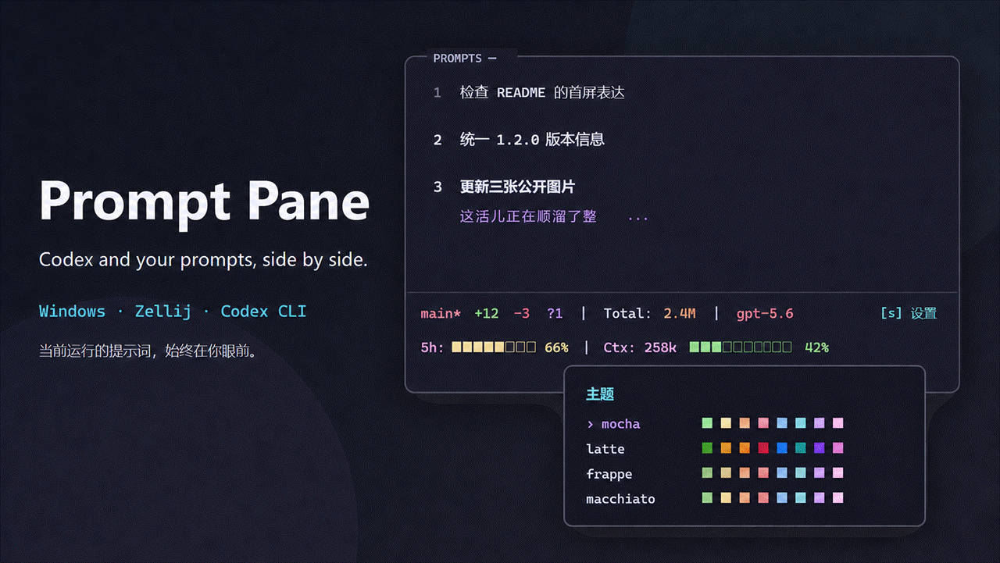
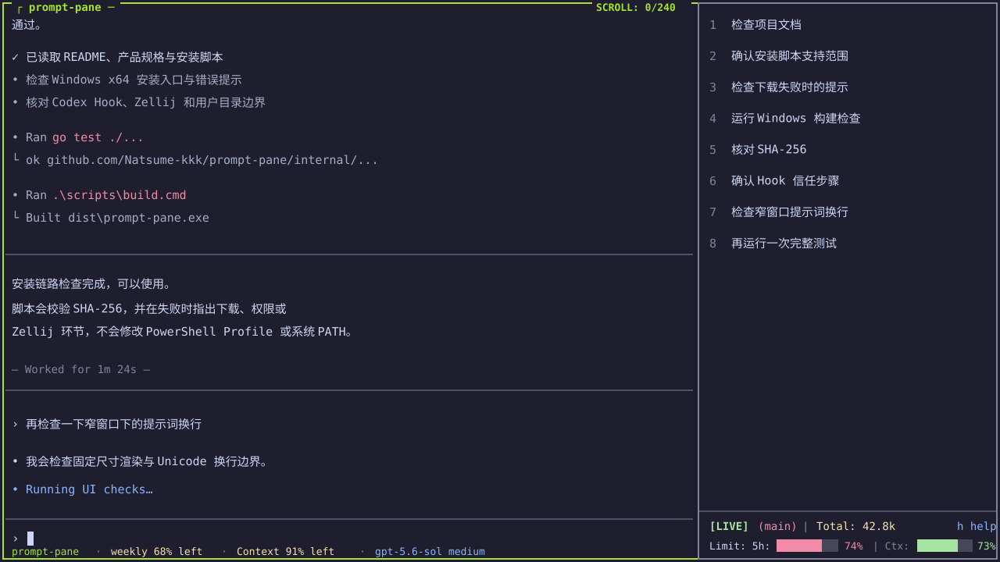
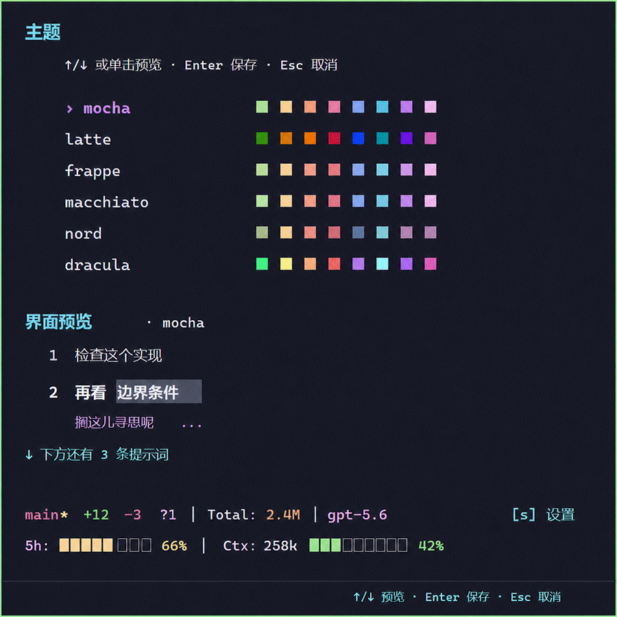

# Prompt Pane

在同一个终端工作区里使用 Codex，并随时回看自己在本次会话提交过的提示词。



左侧是完整的 Codex CLI，右侧是只属于当前运行的 prompt 列表。无需切换窗口，也不用在回答和工具输出中向上翻找。

## 你会得到什么

- 固定的 70/30 双栏工作区，Codex 始终在左侧获得输入焦点。
- 提交 prompt 后，右侧实时追加原始文本，保留中文、多行、emoji 和重复提交。
- 显示当前会话的 token、上下文、5 小时／7 天限额、模型和 Git 状态。
- 六套内置主题，可直接在 Help 中预览和保存。
- prompt 只在本机处理，不建立历史数据库。

## 安装

支持 Windows x64、Windows PowerShell 5.1／PowerShell 7、Zellij 0.44.3 和 Codex CLI。在 PowerShell 中运行：

```powershell
irm https://raw.githubusercontent.com/Natsume-kkk/prompt-pane/main/scripts/install.ps1 | iex
```

当前稳定版本为 [`v1.1.0`](https://github.com/Natsume-kkk/prompt-pane/releases/tag/v1.1.0)；预编译程序、SHA-256 校验文件和第三方声明统一由该 GitHub Release 提供。

重复运行同一条命令即可升级。脚本会下载 Windows x64 发布物、校验 SHA-256、安装到当前用户目录并配置 Codex 集成；不需要管理员权限，也不会修改 PowerShell Profile、执行策略或系统 `PATH`。刷新受管 Codex 组件前需要先关闭所有正在运行的 Prompt Pane 工作区；插件与 `codex.pp` 会先暂存并校验，任一步失败时恢复刷新前的版本。

<details>
<summary>不允许执行远程脚本，或需要代理时</summary>

先下载并审查脚本，再执行：

```powershell
irm https://raw.githubusercontent.com/Natsume-kkk/prompt-pane/main/scripts/install.ps1 -OutFile .\install.ps1
powershell.exe -NoProfile -ExecutionPolicy Bypass -File .\install.ps1
```

主程序下载使用当前 PowerShell 的代理和证书设置。Zellij 下载读取 `HTTP_PROXY`、`HTTPS_PROXY` 和 `NO_PROXY`；如果网络只配置了 Windows 系统代理，请设置 `HTTPS_PROXY`，或提前把 Zellij 0.44.3 放入 `PATH`。

```powershell
$env:HTTPS_PROXY = "http://proxy.example:8080"
```

</details>

安装完成后运行：

```powershell
codex.pp
```

首次使用时先提交一条 prompt。如果右侧没有更新，按 `h` 打开 Help，再在 Codex 中运行 `/hooks`，审查并信任 Prompt Pane Hook 后重新启动 `codex.pp`。

<details>
<summary>从源码构建</summary>

需要提前安装 Codex CLI、Git 和 Go 1.26.6 或更高版本。

```powershell
git clone https://github.com/Natsume-kkk/prompt-pane.git
cd prompt-pane
.\scripts\build.cmd
.\dist\prompt-pane.exe setup codex
```

</details>

## 日常使用

Prompt Pane 不会替换原来的 `codex` 命令。只有 `codex.pp` 会进入双栏工作区，Codex 参数会原样转发：



```powershell
codex.pp
codex.pp resume
```

常用操作：

| 操作 | 按键或鼠标 |
|---|---|
| 选择上一／下一条 prompt | `↑`／`↓` 或 `k`／`j` |
| 翻页 | `PgUp`／`PgDn` 或滚轮 |
| 跳到第一条／最新一条 | `Home`／`End` |
| 展开／折叠长 prompt | `Enter` |
| 打开 Help 和主题设置 | `h` |
| 关闭右侧 viewer | `Ctrl+X` |
| 退出整个工作区 | 关闭终端或使用 Zellij 的 `Ctrl+Q` |
| 复制可见文字 | 按住左键拖动，松开后复制 |

关闭 viewer 不会退出左侧 Codex；关闭终端会结束当前 Prompt Pane 工作区及其中的 Codex。如果拖动无法复制，可以按住 `Shift` 使用终端原生选择。

<p align="center">
  
</p>

## 会话与隐私

- 只显示当前 `codex.pp` 运行期间由 Codex Hook 收到的新 prompt，不显示回答、推理、工具或系统消息。
- 新会话、恢复会话和 `/clear` 会从空白开始；`/compact` 保留本次运行已经显示的 prompt。
- `/side` 和 `/btw` 的内容只临时覆盖右侧，回到主会话后不会混入主 prompt 列表。
- 不扫描 Codex 会话目录，不按最近文件猜测会话，不把 prompt 写入日志、配置、缓存或遥测。
- 并发运行使用独立身份和本地连接，不共享 prompt。

完整安全边界见 [SECURITY.md](SECURITY.md)。

## 排障与移除

安装或启动失败时先运行：

```powershell
& "$env:APPDATA\PromptPane\bin\prompt-pane.exe" doctor
```

错误信息会指出失败的是 GitHub 下载、SHA-256、Zellij、Codex 插件、权限还是 `codex.pp` 冲突，并给出对应处理方向。

移除 Prompt Pane 管理的 Codex 集成：

```powershell
& "$env:APPDATA\PromptPane\bin\prompt-pane.exe" teardown codex
```

该命令不会删除用户原有的 Codex CLI 或已经下载的 Zellij。

## 当前限制

- 只正式支持 Windows x64、PowerShell、Zellij 和 Codex CLI。
- 不能连接已经运行的 Codex。
- 不提供全局历史、搜索、编辑、导出、收藏或同步。
- 不支持 Codex 之外的 AI 命令行工具，也不承诺 WSL、SSH、容器、macOS 或 Linux 可用。
- 字体和像素级渲染由终端控制；部分字体下中文拖选高亮可能出现半格视觉残影，但复制内容仍按完整 Unicode 字素处理。

## 开发与文档

```powershell
go fmt ./...
go vet ./...
go test ./...
go test -race ./...
.\scripts\build.cmd
```

Windows 本机执行 race 检查需要 CGO 可用的 C 编译器；缺少该工具链时，`go test -race ./...` 无法构建，正式发布结果以 Windows CI 的同项检查为准。

- [产品规格](docs/product.md)
- [架构规格](docs/architecture.md)
- [UI 规格](docs/ui.md)
- [贡献指南](CONTRIBUTING.md)

## 许可证

Prompt Pane 使用 [Apache License 2.0](LICENSE)。第三方 Go 模块和视觉设计来源见 [THIRD_PARTY_NOTICES.md](THIRD_PARTY_NOTICES.md)。
